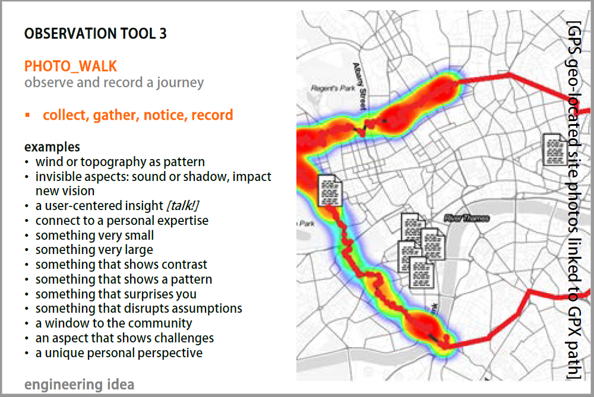
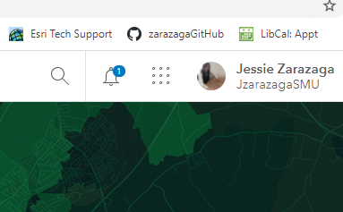
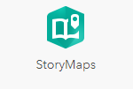
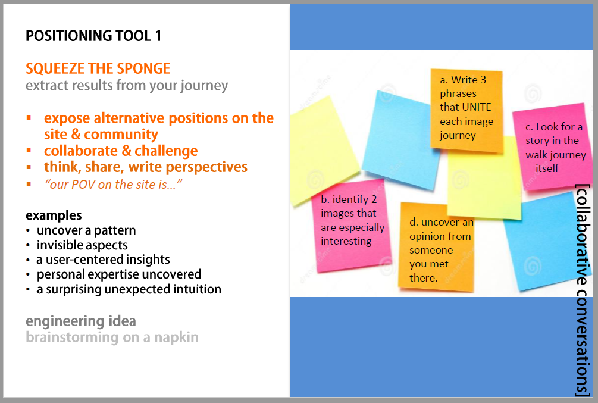
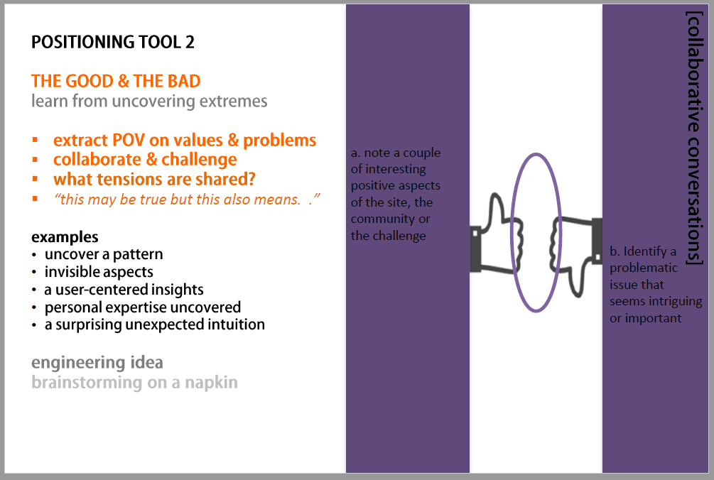
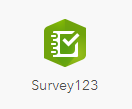
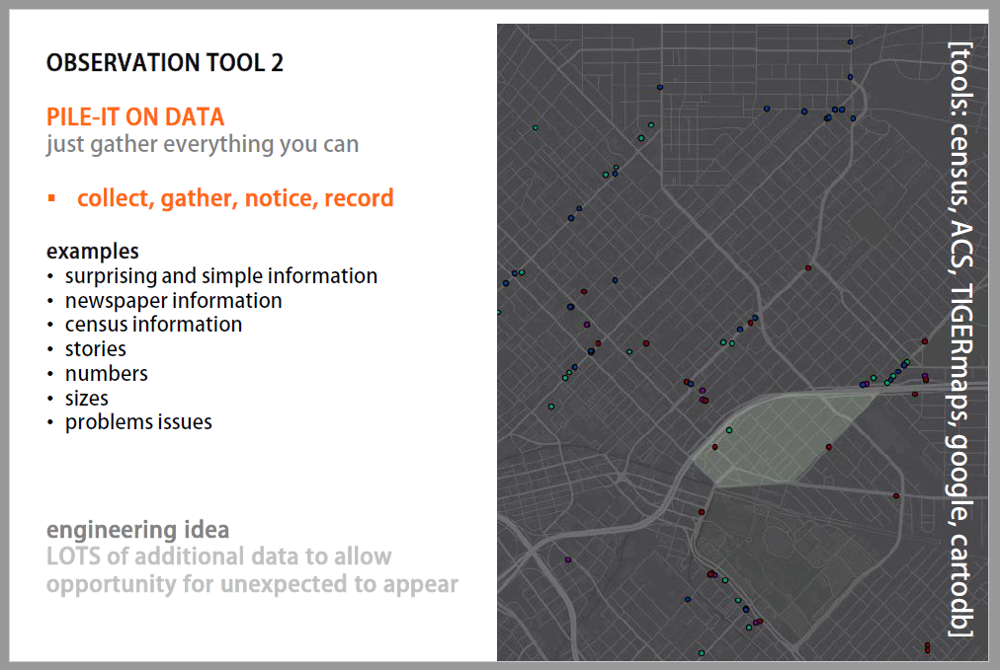
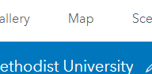
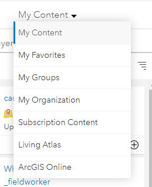

# Workshop: Walk_Make
### Introduction to gathering spatial data, using design thinking to find a reseaarch idea, create a survey, make a map and a Storymap. 
## 1.1 Infrastructure Deserts
 [What are Infrastructure Deserts](https://arcg.is/08mLK1)_ Clowder Research Project Link. 
 
 Concentrate on layers of neighborhood infrastructure, and the Social Impacts of Infrastructure

## 1.2 GeoDesign Cards:Observation Tool 3
How to do a photo_walk. Use a smartphone with location enabled, so that GPS data is gathered along with the images. Photograph aspects that intrigue. Follow the list of examples, keep in mind an emphasis on infrastructure assessment.

**note: ArcGIS doesn't work well with vertical photos- try to stick with landscape format images.**
Save the images into a folder on the computer. Check that they have location data **(properties, GPS)**

## Sign up for an SMU ArcGIS online Account
[ArcGIS Online](https://www.arcgis.com) 
Signin through *Your ArcGIS organization's URL: SMUdallas* then signin through the usual SMU login.
[SMU ArcGIS account access instructions](https://arcg.is/0arbLO0)

## 1.3 Import geo-stamped photos into a Storymap Tour
Find the 9-square grid, and use the dropdown to see available APPS.

Follow the app for *Storymaps* . Add a + New Story' - use the dropdown to start with a 'Guided map tour'!

Browse to the images folder and import them into Storymap. Select colors and map background.
[Erik's Photo_walk example](https://arcg.is/0jXWOe)

## 1.4 GeoDesign Cards:Positioning Tools 1 + 2

Use the PT1 questions to work with a team. THe intention is to allow your intuitive understanding of the site to become visible, through the way you uncover issues of infrastructure. Don't start with the problem, uncover the porblem through the aspects of the site that have caught your attention- the problem may be different from what you first expected to see. 

Use Positioning Tool 2 to work from the things you have seen, to uncovering the opinions or positions that you take, or want to take, on these observations.  Observations are not neutral. 

This process allows one to uncover the unexpected, rather than fall back on the familiar. 

A *design idea* is not really just an idea, but involves taking sides- taking a position - on an aspect of the work, the research or the site. 

Finish with **"my POV (point-of-view) on the site is that** . . . ."

## 1.5 Create Data: Write a survey to further investigate the POV. Gather site data. 

Return to the 9-square dropdown, and the APP called 'Survey 123'.

A simple structure for creating a survey, this GIS based app has two unusal features:
1. It allows the collection of location, when one adds a map to the survey.
2. It allows the collection of photos with data collection.
3. The App can be downloaded onto a smartphone (apple and android) to allow on-site data collection. 
Design a survey to collect data specific to the Point-Of-View determined and defined. 
Ensure that drop-downs are used to gather attributes of the dataset- since these allow statistics to be identified. 
Make a New Survey, and work through the options. When saving it, be sure to make the survey public. 
Use Survey 123 to gather at least 10-20 elements of site data.

[Prosper's StoryMap Example](https://arcg.is/yKXHL) 

This example, from a full semester project, goes through Photo_Walk, Positioning Tools 1-4, and Survey 123, and then to Heuristic Cards for design-ideas, giving an example of where this process can lead.
## 1.6 GeoDesign Cards:Observation Tool 2_pile it on data

Reurn to ArcGIS Online Home - and then the Tab for *Map*

Add layers to a New Map. Use the dropdown to ensure that the search for Content is beyond 'My Content' and is, in fact, searching the whole of 'ArcGIS Online' for interesting and useful content' 

Create a layered GIS map of the same neighborhood as the study, gathering data from online sources to uncover aspects that support, or add richness, to the data found and made. There are tens of thousands of datasets online - it's exciting to explore possible datasets. Look at the metadata for the layers chosen to ensure that there is some level of beliveability in the data. 

Another New Map can be made with the specific site data gathered from the Survey 123. 

## 1.7 Research analysis presentation in a Storymap
Add to the original Photo_Wlk tour storymap with the additional design research and infrastructure work. 
Ensure that at least 2 maps are part of the Story.

Include the following:
* photo tour with location map
* photos of OB3 post-its and notes
* photos and text explaining the PT 2 process and outcomes
* POV statement (with images)
* screen-shots of Survey123 questions and link to survey
* images of survey outcome statistics or charts
* map layer from Survey123 data collection
* map from OB2 with masses of data
* outcome statement describing what has been discovered and revealed about infrastructure in this neighborhood.
